# Day 08 – Deploying Nginx Server on AWS EC2 Instance

> **Date:** 18 February 2026  
> **Author:** Rameez Ahmed  
> **Region:** Europe (Ireland) – `eu-west-1`

---

## 📋 Task Overview

The goal of this task is to:

1. Launch an **AWS EC2 instance** running Ubuntu.
2. **SSH** into the instance.
3. **Install Nginx** web server on the instance.
4. **Configure the Security Group** inbound rules to allow HTTP (port 80) traffic from the internet.
5. **Verify** that Nginx is accessible from a browser over the public IP.
6. **Inspect** Nginx access logs to confirm incoming traffic.

---

## 🔧 Step 1 – Navigate to the EC2 Dashboard

Open the **AWS Management Console** and navigate to the **EC2** service. From the EC2 dashboard, click the **Launch Instance** button to begin creating a new virtual server.

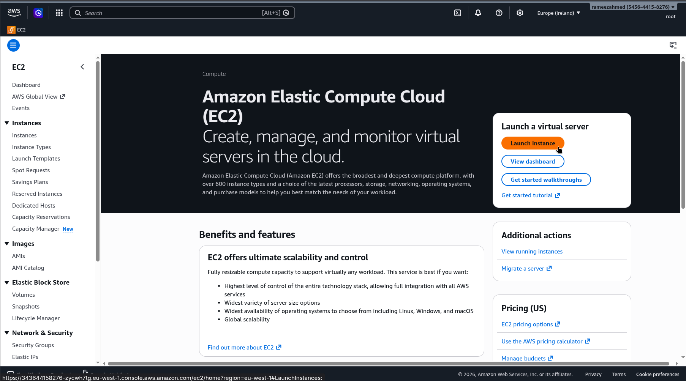

---

## 🖥️ Step 2 – Configure the Instance

### Name and Tags

- **Name:** `nginx-server`

### Application and OS Image (AMI)

- **OS:** Ubuntu (Quick Start)
- **AMI:** Ubuntu Server 24.04 LTS (HVM), SSD Volume Type
- **AMI ID:** `ami-03446a3af42c5e74e`
- **Architecture:** 64-bit (x86)
- **Free Tier Eligible:** ✅ Yes

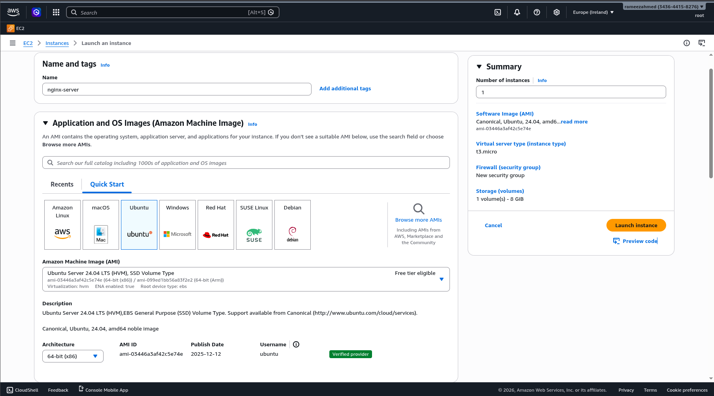

---

## ⚙️ Step 3 – Choose Instance Type & Key Pair

### Instance Type

- **Type:** `t3.micro` (2 vCPU, 1 GiB Memory) – Free Tier Eligible

### Key Pair (Login)

- **Key Pair Name:** `nginx-server-key`
- Used to securely connect to the instance via SSH.

### Network Settings

- **VPC:** `vpc-08ee45a7e2b18123e`
- **Auto-assign Public IP:** Enabled
- **Firewall (Security Groups):** Create a new security group (`launch-wizard-1`)
  - ✅ Allow SSH traffic from **Anywhere** (`0.0.0.0/0`)

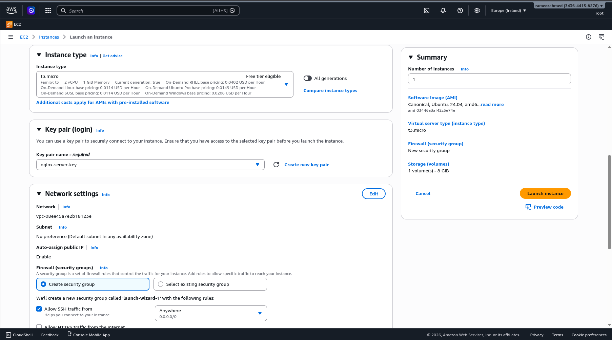

---

## 💾 Step 4 – Configure Storage & Launch

### Storage

- **1x 8 GiB** – `gp3` Root volume, 3000 IOPS, Not encrypted

After reviewing all settings, click the **Launch Instance** button.

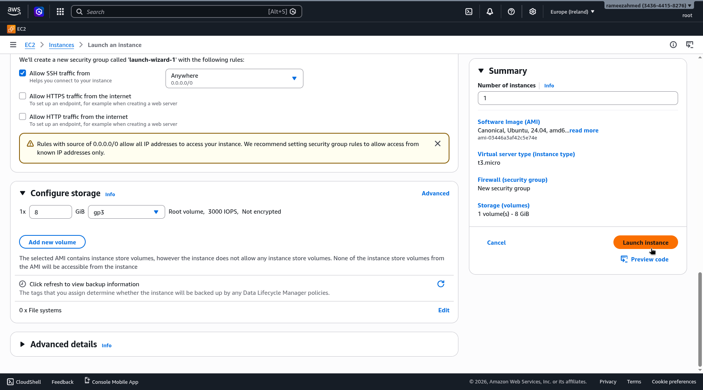

---

## 🔗 Step 5 – Connect to the Instance via SSH

Once the instance is in the **Running** state, go to **Instances → Connect** and select the **SSH client** tab.

### Connection Details

| Field              | Value                                                          |
| ------------------ | -------------------------------------------------------------- |
| **Instance ID**    | `i-056c40c620930e8c2` (nginx-server)                           |
| **VPC ID**         | `vpc-08ee45a7e2b18123e`                                        |
| **Security Group** | `sg-0faf8cc6d417b51b4` (launch-wizard-1)                       |
| **Public DNS**     | `ec2-3-255-205-188.eu-west-1.compute.amazonaws.com`            |
| **Key File**       | `nginx-server-key.pem`                                         |

### SSH Commands

```bash
# Set correct permissions on the key file
chmod 400 "nginx-server-key.pem"

# Connect to the instance
ssh -i "nginx-server-key.pem" ubuntu@ec2-3-255-205-188.eu-west-1.compute.amazonaws.com
```

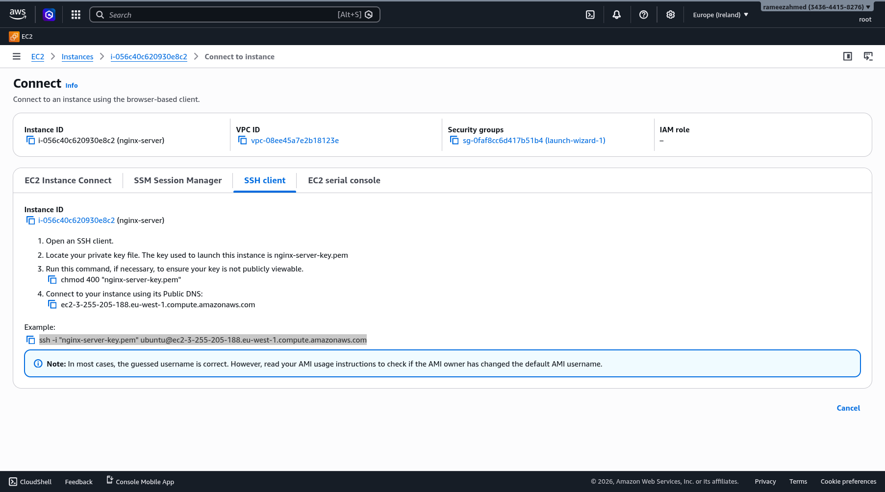

---

## 🔐 Step 6 – SSH Into the Server

From the local terminal, run the SSH command. On the first connection, accept the host fingerprint by typing `yes`.

```
$ ssh -i "nginx-server-key.pem" ubuntu@ec2-3-255-205-188.eu-west-1.compute.amazonaws.com

The authenticity of host 'ec2-3-255-205-188.eu-west-1.compute.amazonaws.com (3.255.205.188)' can't be established.
ED25519 key fingerprint is SHA256:zsUgfvXMa+QmHm39g+ghicecu0z04mpIVDANp1RsWXY.
This key is not known by any other names.
Are you sure you want to continue connecting (yes/no/[fingerprint])? yes
```

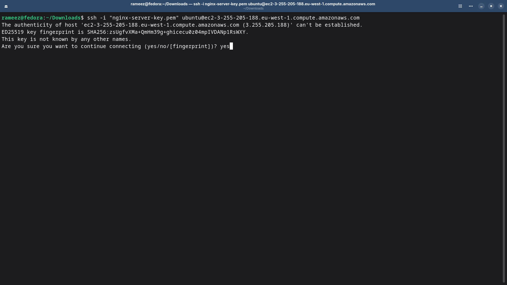

---

## 📦 Step 7 – Update System Packages

Once connected, update the package lists to ensure you install the latest available versions.

```bash
sudo apt update
```

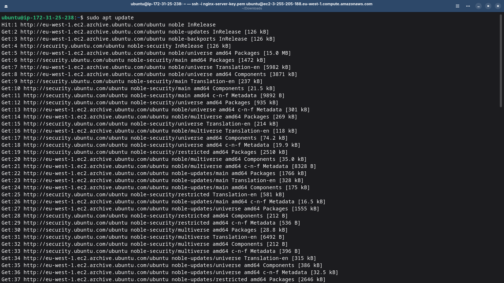

---

## 🌐 Step 8 – Install Nginx

Install the Nginx web server using the `apt` package manager.

```bash
sudo apt install nginx
```

- **Nginx version installed:** `1.24.0-2ubuntu7.6`
- Packages installed: `nginx`, `nginx-common`

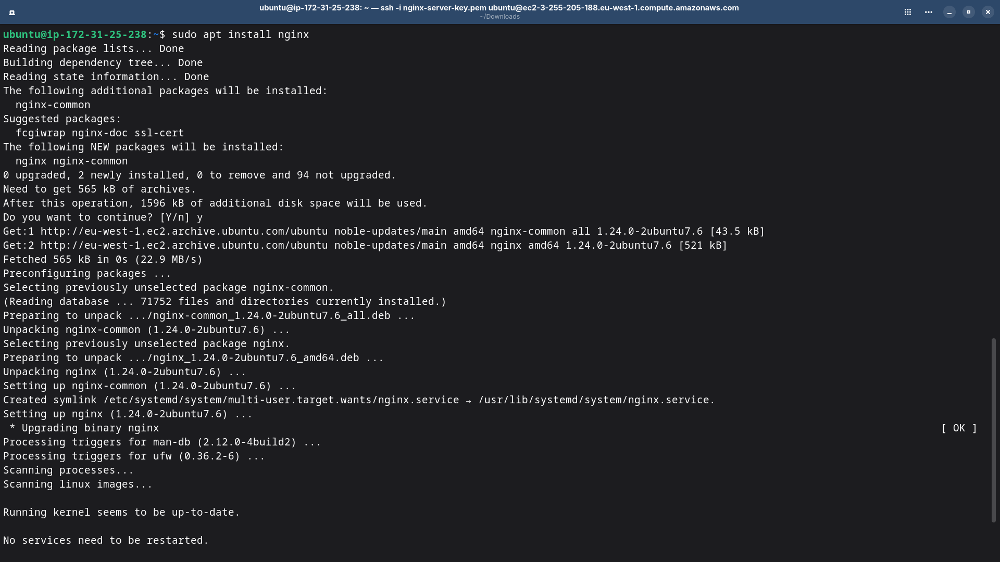

---

## ✅ Step 9 – Verify Nginx Status

Check that Nginx is running and enabled using `systemctl`.

```bash
systemctl status nginx
```

**Output confirms:**
- **Active:** `active (running)` ✅
- **Enabled:** `enabled` (starts on boot)
- **Main PID:** `1763`
- **Workers:** 2 worker processes

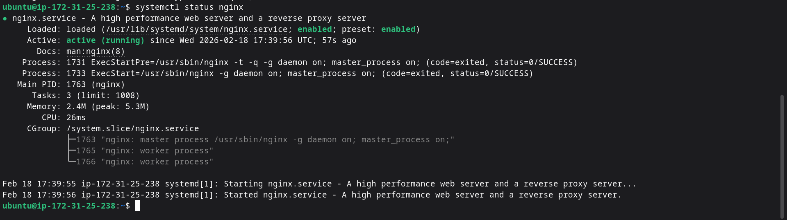

---

## 🛡️ Step 10 – View Instance Security Details

Navigate back to the **EC2 Instances** page in the AWS Console. Select the `nginx-server` instance and go to the **Security** tab.

### Security Details

| Field              | Value                                               |
| ------------------ | --------------------------------------------------- |
| **Security Group** | `sg-0faf8cc6d417b51b4` (launch-wizard-1)            |
| **Owner ID**       | `343644158276`                                      |
| **Launch Time**    | Wed Feb 18 2026 22:34:44 GMT+0500 (Pakistan Standard Time) |

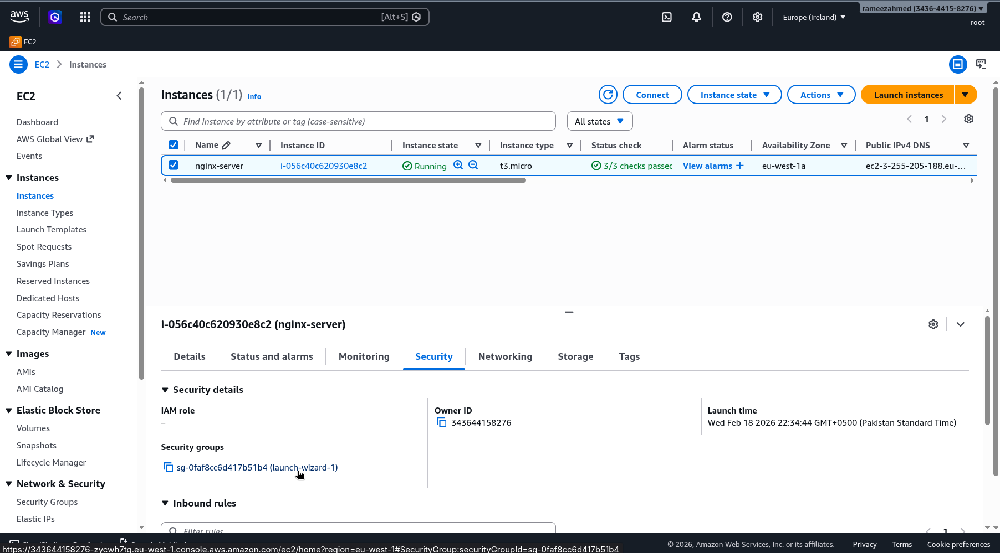

---

## 🔓 Step 11 – Add HTTP Inbound Rule to Security Group

To make Nginx accessible from the internet, an HTTP inbound rule must be added to the security group.

Navigate to **EC2 → Security Groups → sg-0faf8cc6d417b51b4 (launch-wizard-1) → Edit inbound rules**.

### Inbound Rules Configuration

| Security Group Rule ID  | Type | Protocol | Port Range | Source          |
| ----------------------- | ---- | -------- | ---------- | --------------- |
| `sgr-0750c27ffe5256d59` | SSH  | TCP      | 22         | `0.0.0.0/0`    |
| *(new rule)*            | HTTP | TCP      | 80         | Anywhere (`0.0.0.0/0`) |

Click **Save rules** to apply the changes.

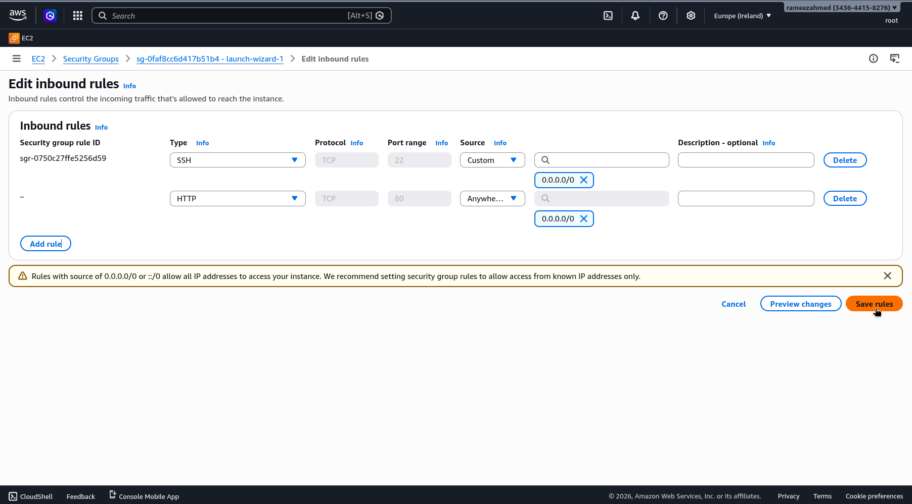

---

## 🎉 Step 12 – Access Nginx from the Browser

Open a web browser and navigate to the instance's **Public IP address**:

```
http://3.255.205.188
```

The default **"Welcome to nginx!"** page is displayed, confirming that Nginx is successfully installed, running, and accessible from the internet. 🎉

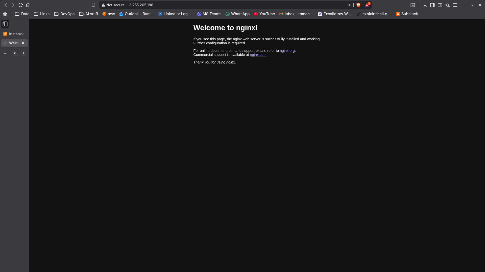

---

## 📊 Step 13 – Check Nginx Access Logs

To confirm that the incoming HTTP requests are being logged, inspect the Nginx access log:

```bash
cat /var/log/nginx/access.log
tail -f /var/log/nginx/access.log
```

The logs show successful `GET /` requests (HTTP 200) from the browser, confirming real traffic is hitting the server.


---

## 📝 Step 14 – Extract Nginx Logs

Optionally, copy the access logs to a file in the home directory for archival or further analysis:

```bash
cat /var/log/nginx/access.log >> /home/ubuntu/nginx_extracted.log
cat /home/ubuntu/nginx_extracted.log
```

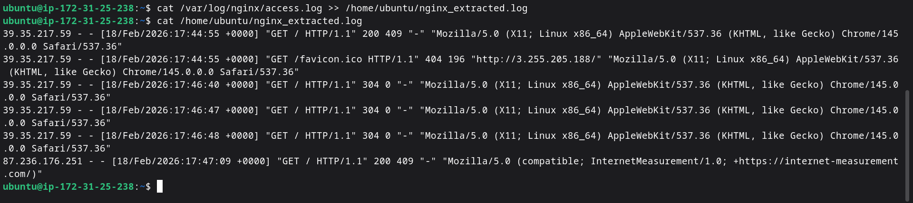

---

## 📌 Summary

| Step | Action                                      | Status |
| ---- | ------------------------------------------- | ------ |
| 1    | Navigate to EC2 Dashboard                   | ✅      |
| 2    | Configure instance name & AMI (Ubuntu 24.04)| ✅      |
| 3    | Select instance type (`t3.micro`) & key pair| ✅      |
| 4    | Configure storage (8 GiB gp3) & launch      | ✅      |
| 5    | Get SSH connection details                   | ✅      |
| 6    | SSH into the instance                        | ✅      |
| 7    | Update system packages (`apt update`)        | ✅      |
| 8    | Install Nginx (`apt install nginx`)          | ✅      |
| 9    | Verify Nginx is active & running             | ✅      |
| 10   | Review Security Group details                | ✅      |
| 11   | Add HTTP (port 80) inbound rule              | ✅      |
| 12   | Access Nginx welcome page via browser        | ✅      |
| 13   | Inspect Nginx access logs                    | ✅      |
| 14   | Extract and archive Nginx logs               | ✅      |

---

## 🔑 Key Takeaways

- **EC2** provides on-demand virtual servers in the cloud with flexible instance types.
- **Security Groups** act as virtual firewalls — by default, only SSH (port 22) is allowed; HTTP (port 80) must be explicitly added to serve web traffic.
- **Nginx** is a lightweight, high-performance web server that can be installed with a single `apt install` command on Ubuntu.
- Always verify services with `systemctl status` and confirm network accessibility through the browser.
- **Access logs** (`/var/log/nginx/access.log`) are invaluable for monitoring and debugging incoming traffic.
