# 🐳 Day 30 — Docker Images & Container Lifecycle

<div align="center">


*Understand how images are built from layers, and master every state a container goes through*

</div>

---

## 📑 Table of Contents

1. [Task 1: Docker Images](#task-1-docker-images)
2. [Task 2: Image Layers](#task-2-image-layers)
3. [Task 3: Container Lifecycle](#task-3-container-lifecycle)
4. [Task 4: Working with Running Containers](#task-4-working-with-running-containers)
5. [Task 5: Cleanup](#task-5-cleanup)
6. [Commands Reference](#-commands-reference-with-flags)

---

## Task 1: Docker Images

### What is a Docker Image?

A Docker image is a **read-only template** that contains everything needed to run an application — the operating system, application code, libraries, dependencies, and configuration. Think of it like a **snapshot** or a **recipe** — you use it to create containers, but you never modify the image itself.

```
IMAGE (Read-Only Blueprint)              CONTAINER (Running Instance)
┌─────────────────────────┐             ┌─────────────────────────┐
│  OS base layer          │             │  Writable layer (thin)  │
│  + App dependencies     │── run ────▶ │  + Everything from image│
│  + Application code     │             │  + Your runtime changes │
│  + Config files         │             │  = A live, running app  │
└─────────────────────────┘             └─────────────────────────┘
   Can't be changed                        Can be changed (but changes
   Stored on disk                          are lost when container dies)
```

---

### 1.1 Pulling Images from Docker Hub

Docker Hub is the default **public registry** — think of it as an app store for Docker images. When you `docker pull`, Docker downloads the image from Docker Hub to your local machine.

#### Pulling Nginx

```bash
docker pull nginx
```

**What this command does:**
- Connects to Docker Hub (`docker.io/library/nginx`)
- Downloads the `latest` tag (default if no tag specified)
- Pulls each **layer** one by one (notice each hash ID being pulled)
- Stores the complete image locally

> 📸 **Screenshot:** Pulling Nginx image — notice how each layer is downloaded separately:
>
> 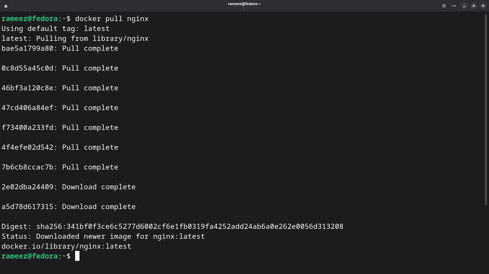
>
> **What to observe:** Each line like `bae5a1799a80: Pull complete` is a separate **layer** being downloaded. Nginx has ~7 layers. The digest (sha256:...) is a unique fingerprint of this exact image version.

---

#### Pulling Ubuntu

```bash
docker pull ubuntu
```

> 📸 **Screenshot:** Pulling Ubuntu image — notice how much fewer layers it has:
>
> 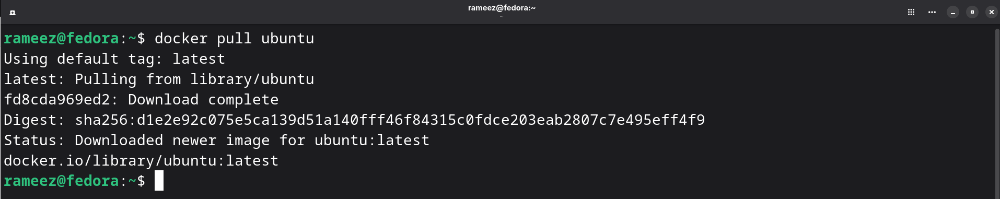
>
> **What to observe:** Ubuntu only has **1 layer** (`fd8cda969ed2: Download complete`) compared to Nginx's 7+ layers. That's because Ubuntu is a base OS image — it's just the filesystem. Nginx adds web server software on top.

---

#### Pulling Alpine

```bash
docker pull alpine
```

> 📸 **Screenshot:** Pulling Alpine — the smallest Linux distribution:
>
> 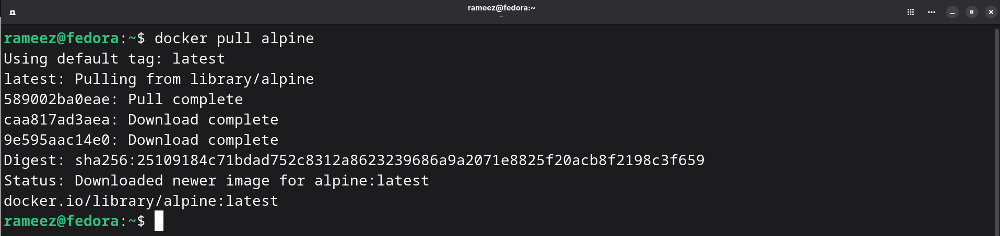
>
> **What to observe:** Alpine has just **1 layer** and is incredibly small. It's built from scratch to be minimal.

---

### 1.2 Listing All Images — Comparing Sizes

```bash
docker images
```

#### Command Breakdown

| Command | What It Does |
|---------|-------------|
| `docker images` | List all local images (short form) |
| `docker images -a` | List ALL images, including intermediate layers |
| `docker image ls` | Same as `docker images` (modern syntax) |

> 📸 **Screenshot:** Listing all images and their sizes:
>
> 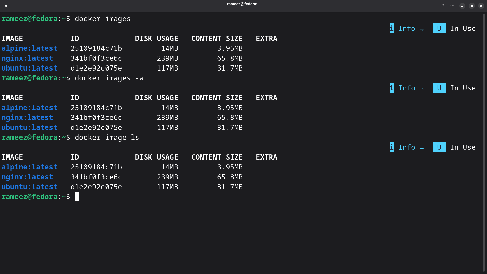
>
> **What to observe:** Three commands shown — `docker images`, `docker images -a`, and `docker image ls` — all produce the same output. Notice the size differences:

#### Size Comparison

| Image | Disk Usage | Content Size | Layers | Purpose |
|-------|:----------:|:------------:|:------:|---------|
| **alpine:latest** | 14 MB | 3.95 MB | 1 | Minimal Linux — just enough to run |
| **ubuntu:latest** | 117 MB | 31.7 MB | 1 | Full Ubuntu base — apt, bash, coreutils |
| **nginx:latest** | 239 MB | 65.8 MB | 7+ | Ubuntu base + Nginx web server + config |

#### Why is Alpine So Much Smaller Than Ubuntu?

```
UBUNTU (117 MB)                          ALPINE (14 MB)
┌──────────────────────────┐            ┌──────────────────────────┐
│  apt (package manager)   │            │  apk (package manager)   │
│  bash, coreutils         │            │  busybox (multi-tool)    │
│  systemd libs            │            │  musl libc (tiny C lib)  │
│  GNU C Library (glibc)   │            │  No extras               │
│  Ubuntu-specific tools   │            │                          │
│  More packages installed │            │  Built to be MINIMAL     │
└──────────────────────────┘            └──────────────────────────┘

Alpine uses:
• musl libc instead of glibc (much smaller)
• busybox instead of coreutils (1 binary = 300+ commands)
• apk instead of apt (lighter package manager)
• No unnecessary packages — you install only what you need
```

> 💡 **DevOps takeaway:** Use Alpine as your base image when building production containers. Smaller image = faster downloads, less disk, smaller attack surface.

---

### 1.3 Inspecting an Image

```bash
docker inspect nginx
```

#### Command Breakdown

| Flag/Option | What It Does |
|-------------|-------------|
| `docker inspect <image>` | Show detailed JSON metadata about an image |
| `docker inspect --format '{{.Config.ExposedPorts}}' nginx` | Extract specific fields using Go templates |

> 📸 **Screenshot:** Inspecting the Nginx image — detailed JSON output:
>
> 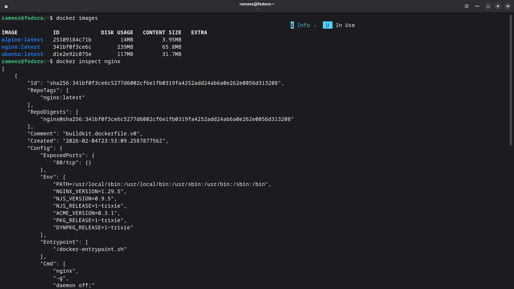
>
> **What to observe from the inspect output:**

| Field | Value | What It Tells You |
|-------|-------|------------------|
| `Id` | `sha256:341bf0f3ce6c...` | Unique identifier for this image |
| `RepoTags` | `["nginx:latest"]` | Name and tag of the image |
| `Created` | `2026-02-04T23:53:09Z` | When this image was built |
| `ExposedPorts` | `"80/tcp": {}` | Nginx listens on port 80 |
| `NGINX_VERSION` | `1.29.5` | The Nginx version installed |
| `Entrypoint` | `["/docker-entrypoint.sh"]` | Script that runs when container starts |
| `Cmd` | `["nginx", "-g", "daemon off;"]` | Default command — runs Nginx in foreground |

> 💡 **Why `daemon off;`?** Normally Nginx runs as a background daemon. In a container, the main process must run in the **foreground** — if it backgrounds itself, Docker thinks the container has finished and stops it.

---

### 1.4 Removing Images

```bash
# Remove a specific image by name
docker image rm alpine

# Alternative shorter syntax
docker rmi nginx

# Verify they're removed
docker images
```

#### Command Breakdown

| Command | What It Does |
|---------|-------------|
| `docker image rm <image>` | Remove a specific image (modern syntax) |
| `docker rmi <image>` | Remove a specific image (short form) |
| `docker rmi -f <image>` | Force remove (even if a container is using it) |

> 📸 **Screenshot:** Removing Alpine and Nginx images one by one:
>
> 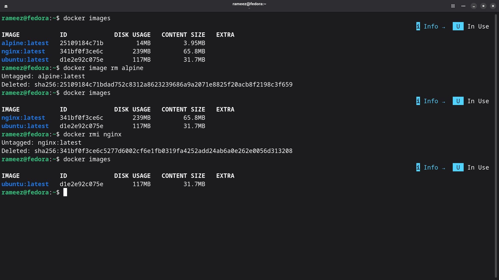
>
> **What to observe:**
> - `docker image rm alpine` → Untagged and deleted Alpine
> - `docker rmi nginx` → Untagged and deleted Nginx (the `sha256:...` is removed from disk)
> - `docker images` after each removal shows the image is gone
> - Only `ubuntu:latest` remains after removing both

---

## Task 2: Image Layers

### What Are Layers?

Every Docker image is made up of **layers** stacked on top of each other. Each layer represents a single instruction in the Dockerfile that was used to build the image (like `RUN`, `COPY`, or `ADD`).

```
HOW LAYERS WORK:

  Nginx Image (7+ layers)
  ┌─────────────────────────────────────┐
  │ Layer 7: CMD ["nginx", "-g", ...]   │  0 B   ← Just metadata
  ├─────────────────────────────────────┤
  │ Layer 6: EXPOSE 80                  │  0 B   ← Just metadata
  ├─────────────────────────────────────┤
  │ Layer 5: COPY docker-entrypoint.sh  │  4.1kB ← Small config file
  ├─────────────────────────────────────┤
  │ Layer 4: COPY config files          │  4.1kB ← Nginx config
  ├─────────────────────────────────────┤
  │ Layer 3: RUN apt install nginx      │  87 MB ← Nginx + dependencies
  ├─────────────────────────────────────┤
  │ Layer 2: ENV variables              │  0 B   ← Just metadata
  ├─────────────────────────────────────┤
  │ Layer 1: Base OS (Debian trixie)    │  86 MB ← Operating system base
  └─────────────────────────────────────┘

  Layers with 0B size don't add files — they only set metadata
  (environment variables, exposed ports, entrypoints, etc.)
```

### Why Does Docker Use Layers?

| Benefit | How It Works |
|---------|-------------|
| **Caching** | If a layer hasn't changed, Docker reuses the cached version instead of rebuilding it |
| **Sharing** | Multiple images can share common base layers (e.g., both Nginx and Node.js use Debian) |
| **Speed** | Only changed layers need to be re-downloaded or rebuilt — not the entire image |
| **Space** | Shared layers are stored only once on disk, even if 10 images use them |

```
LAYER SHARING EXAMPLE:

  Nginx Image                     Node.js Image
  ┌────────────────┐             ┌────────────────┐
  │ Nginx configs  │             │ Node.js binary │
  ├────────────────┤             ├────────────────┤
  │ apt install    │             │ apt install    │
  │ nginx          │             │ nodejs         │
  ├────────────────┤             ├────────────────┤
  │                │             │                │
  │  Debian Base   │◀───shared──▶│  Debian Base   │
  │  (same layer)  │             │  (same layer)  │
  └────────────────┘             └────────────────┘

  The Debian base layer is stored ONCE on disk,
  even though both images use it. This saves GBs of space.
```

### Viewing Image History (Layers)

```bash
docker image history nginx
docker image history ubuntu
```

#### Command Breakdown

| Command | What It Does |
|---------|-------------|
| `docker image history <image>` | Show each layer, its size, when it was created, and the command that created it |
| `docker image history --no-trunc nginx` | Show full commands without truncation |

> 📸 **Screenshot:** Image history for Nginx and Ubuntu — each line is a layer:
>
> 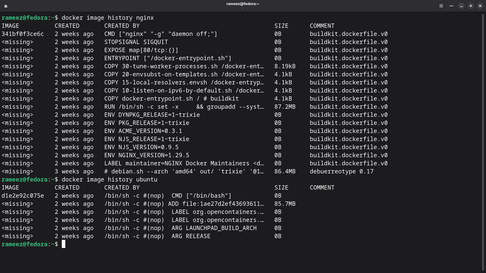
>
> **What to observe in the Nginx history:**

| Layer | Command | Size | What It Does |
|:-----:|---------|:----:|-------------|
| Top | `CMD ["nginx" "-g" "daemon off;"]` | 0 B | Sets the default command (metadata only) |
| | `STOPSIGNAL SIGQUIT` | 0 B | Tells Docker how to gracefully stop Nginx |
| | `EXPOSE map[80/tcp:{}]` | 0 B | Documents that Nginx uses port 80 |
| | `ENTRYPOINT ["/docker-entrypoint.sh"]` | 0 B | Sets the startup script |
| | `COPY 30-tune-worker-processes.sh...` | 8.19 kB | Nginx helper scripts |
| | `COPY 20-envsubst-on-templates.sh...` | 4.1 kB | Template processing script |
| | `COPY 15-local-resolvers.envsh...` | 4.1 kB | DNS resolver config |
| | `COPY 10-listen-on-ipv6-by-default.sh...` | 4.1 kB | IPv6 configuration |
| | `COPY docker-entrypoint.sh...` | 4.1 kB | Main entrypoint script |
| | `RUN /bin/sh -c set -x && groupadd --syst...` | **87.2 MB** | 🔴 Installs Nginx + all dependencies |
| | `ENV DYNPKG_RELEASE=1~trixie` | 0 B | Environment variables |
| | Several `ENV` layers | 0 B | Version numbers and config |
| | `LABEL maintainer=NGINX Docker Maintainers` | 0 B | Image metadata |
| Bottom | `# debian.sh --arch 'amd64' out/ 'trixie'` | **86.4 MB** | 🔴 Base Debian OS filesystem |

> **Key insight:** Only 2 layers account for ~173 MB (the OS base and Nginx installation). All other layers are tiny config files or zero-size metadata. This is why understanding layers matters for optimizing image size.

> **Ubuntu history** is much simpler — just 1 real layer (`ADD file:...` at 85.7 MB) and 5 metadata layers (labels, args, cmd).

---

## Task 3: Container Lifecycle

### The Complete Container Lifecycle

A container goes through several states during its life. Understanding these states is essential for managing containers in production.

```
COMPLETE CONTAINER LIFECYCLE:

  docker create          docker start           docker pause
  ┌──────────────┐      ┌──────────────┐      ┌──────────────┐
  │              │      │              │      │              │
  │   CREATED    │─────▶│   RUNNING    │─────▶│   PAUSED     │
  │              │      │              │      │              │
  └──────────────┘      └──────┬───────┘      └──────┬───────┘
                               │      ▲              │
                               │      │              │
                               │      │    docker unpause
                               │      │              │
                               │      └──────────────┘
                               │
                        docker stop │  docker kill
                               │         │
                               ▼         ▼
                        ┌──────────────┐
                        │              │
                        │   STOPPED    │────────▶ docker rm ────▶ REMOVED
                        │  (Exited)    │                          (Gone)
                        │              │
                        └──────┬───────┘
                               │
                        docker restart
                               │
                               ▼
                        ┌──────────────┐
                        │   RUNNING    │  (back to running)
                        └──────────────┘
```

### Step-by-Step Lifecycle Practice

#### Step 1: Create a container (without starting it)

```bash
docker create --name nginx-container nginx
```

**Command Breakdown:**

| Part | What It Does |
|------|-------------|
| `docker create` | Creates a container from an image but does NOT start it |
| `--name nginx-container` | Assigns the name `nginx-container` to this container |
| `nginx` | The image to use |

```bash
# Check the status
docker ps -a
# STATUS: Created ← Container exists but is NOT running
```

> 📸 **Screenshot:** Create container, check status, start it, restart, and pause:
>
> 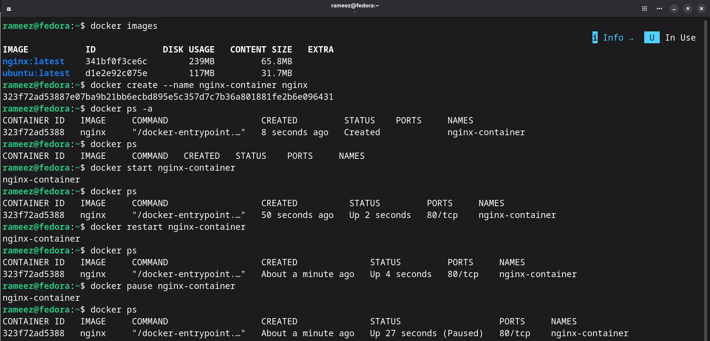
>
> **What to observe step by step:**
> 1. `docker create --name nginx-container nginx` → Returns a long container ID (`323f72ad5388...`)
> 2. `docker ps -a` → Shows status as **"Created"** — container exists but isn't running
> 3. `docker ps` → Empty — because `docker ps` only shows **running** containers
> 4. `docker start nginx-container` → Status changes to **"Up 2 seconds"** with port `80/tcp`
> 5. `docker restart nginx-container` → Briefly stops and starts again — status shows **"Up 4 seconds"**
> 6. `docker pause nginx-container` → Status shows **"Up About a minute (Paused)"** — frozen in place

---

#### Step 2–3: Start and Restart

```bash
# Start the created container
docker start nginx-container

# Restart it (stop + start in one command)
docker restart nginx-container
```

**Command Breakdown:**

| Command | What It Does |
|---------|-------------|
| `docker start <name>` | Start a stopped or created container |
| `docker restart <name>` | Stop and immediately start again (graceful restart) |

---

#### Step 4: Pause and Unpause

```bash
# Freeze the container in place
docker pause nginx-container

# Check status — shows "(Paused)"
docker ps

# Resume the container
docker unpause nginx-container
```

**Command Breakdown:**

| Command | What It Does | Under the Hood |
|---------|-------------|---------------|
| `docker pause <name>` | Freeze all processes in the container | Uses Linux cgroups `freezer` — suspends all processes |
| `docker unpause <name>` | Resume all frozen processes | Unfreezes the cgroup — processes continue where they left off |

> 💡 **When to use pause?** Pause is useful when you need to temporarily free up CPU without losing the container's state — e.g., during resource-intensive operations on the host.

---

#### Step 5–7: Unpause, Kill, and Rename

> 📸 **Screenshot:** Unpause, kill, rename — completing the lifecycle:
>
> 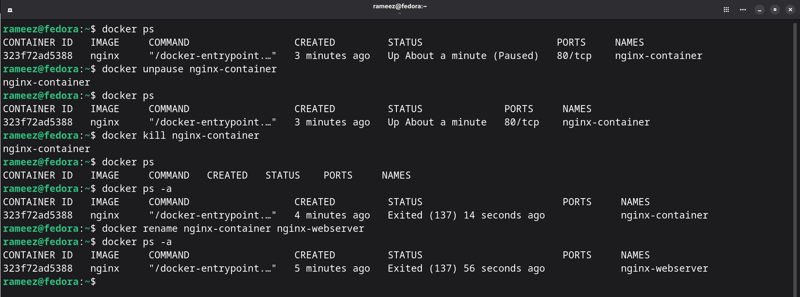
>
> **What to observe:**
> 1. `docker ps` → Shows **"Up About a minute (Paused)"** — container is frozen
> 2. `docker unpause nginx-container` → Container resumes running
> 3. `docker ps` → Status back to **"Up About a minute"** — running normally
> 4. `docker kill nginx-container` → Container immediately stopped
> 5. `docker ps` → Empty (container is stopped)
> 6. `docker ps -a` → Shows **"Exited (137)"** — exit code 137 means killed by SIGKILL
> 7. `docker rename nginx-container nginx-webserver` → Name changed
> 8. `docker ps -a` → Now shows the new name **"nginx-webserver"**

#### `docker stop` vs `docker kill` — What's the Difference?

| Aspect | `docker stop` | `docker kill` |
|--------|:------------:|:------------:|
| **Signal sent** | SIGTERM (then SIGKILL after 10s timeout) | SIGKILL (immediate) |
| **Graceful?** | ✅ Yes — gives the process time to clean up | ❌ No — instant death |
| **Exit code** | Usually `0` (clean exit) | Usually `137` (killed by signal) |
| **When to use** | Normal shutdown — let the app save state | Emergency stop — app is stuck/unresponsive |
| **Timeout** | 10 seconds default (`--time` to change) | None — instant |

```
docker stop:
  1. Send SIGTERM ───▶ Process receives signal
  2. Wait 10 seconds     Process saves state, closes connections
  3. If still running ──▶ Send SIGKILL (forced)

docker kill:
  1. Send SIGKILL ───▶ Process is terminated immediately
     No cleanup, no graceful shutdown
```

#### `docker rename` — Renaming Containers

```bash
docker rename <old-name> <new-name>
```

| Flag/Option | What It Does |
|-------------|-------------|
| `docker rename` | Changes a container's name without stopping it |
| Works on running or stopped containers | No restart needed |

---

## Task 4: Working with Running Containers

### 4.1 Detached Mode and Logs

```bash
# Run Nginx in detached mode with a custom name
docker run -d --name webserver nginx
```

**Command Breakdown:**

| Flag | Full Form | What It Does |
|------|-----------|-------------|
| `-d` | `--detach` | Run the container in the background (detached from your terminal) |
| `--name webserver` | | Assign the name `webserver` to this container |

```bash
# View container logs
docker logs webserver

# Follow logs in real-time (like tail -f)
docker logs -f webserver
```

**Logs Command Flags:**

| Flag | Full Form | What It Does |
|------|-----------|-------------|
| `-f` | `--follow` | Stream logs in real-time (like `tail -f`) — press Ctrl+C to stop |
| `--tail N` | `--tail 20` | Show only the last N lines |
| `-t` | `--timestamps` | Add timestamps to each log line |
| `--since 1h` | | Show logs from the last 1 hour |
| `--until 30m` | | Show logs up to 30 minutes ago |

> 📸 **Screenshot:** Running in detached mode, then viewing real-time logs:
>
> 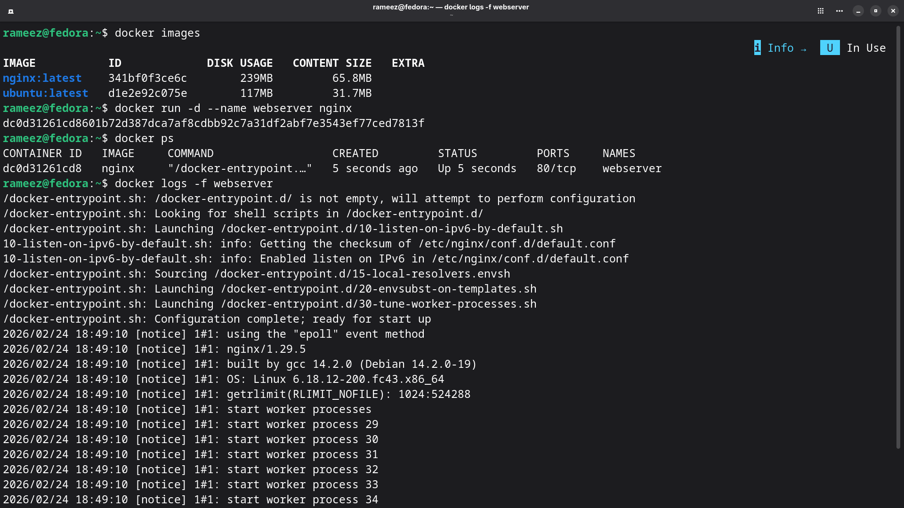
>
> **What to observe:**
> 1. `docker run -d --name webserver nginx` → Returns container ID, your terminal is free
> 2. `docker ps` → Shows `webserver` running with `80/tcp` port
> 3. `docker logs -f webserver` → Shows Nginx startup logs in real-time:
>    - Entrypoint scripts executing
>    - Configuration complete
>    - Nginx 1.29.5 starting with worker processes (29, 30, 31, 32, 33, 34...)
>    - Press Ctrl+C to stop following

---

### 4.2 Exec Into a Running Container

```bash
# Open an interactive shell inside the running container
docker exec -it webserver bash
```

**Command Breakdown:**

| Flag | Full Form | What It Does |
|------|-----------|-------------|
| `-i` | `--interactive` | Keep stdin open (lets you type commands) |
| `-t` | `--tty` | Allocate a pseudo-TTY (gives you a proper command prompt) |
| `bash` | | The shell to open inside the container |

> 📸 **Screenshot:** Exec into the running Nginx container and exploring:
>
> 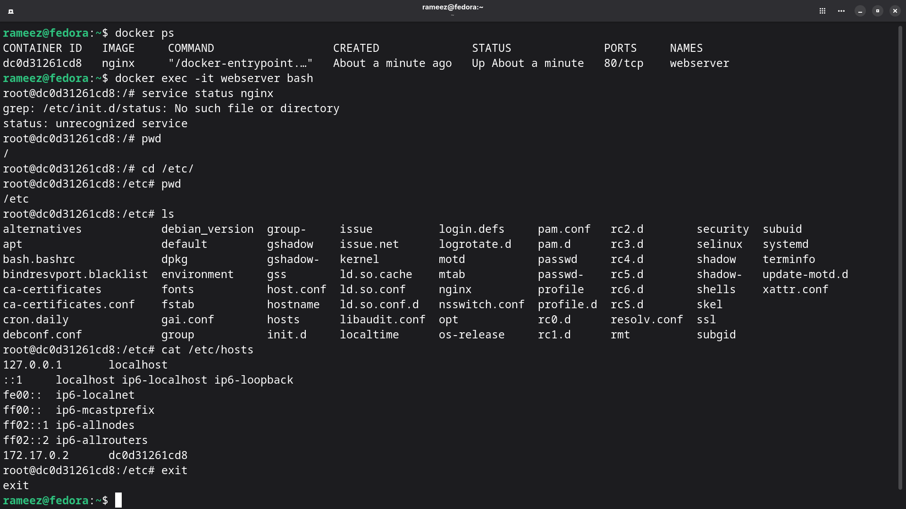
>
> **What to observe:**
> 1. `docker exec -it webserver bash` → You're now **inside** the running container as `root@dc0d31261cd8`
> 2. `service status nginx` → Shows there's no init system (containers are NOT VMs!)
> 3. `pwd` → You're at `/` (root) inside the container
> 4. `cd /etc/` → The `/etc` directory has all config files
> 5. `ls` → You can see `nginx/` directory with Nginx config, `hosts`, `hostname`, etc.
> 6. `cat /etc/hosts` → Shows container networking:
>    - `127.0.0.1 localhost` (standard)
>    - `172.17.0.2 dc0d31261cd8` ← Container's own IP address and hostname
> 7. `exit` → Back to your host machine

---

### 4.3 Running Commands Without Entering the Container

```bash
# Create a file inside the container
docker exec -d webserver touch /home/hello

# Write content to the file
docker exec -d webserver bash -c 'echo "Hello Doston..! from Rameez Ahmed" >> /home/hello'

# Enter the container and verify
docker exec -it webserver bash
cd home/
ls          # → shows "hello" file
cat hello   # → shows "Hello Doston..! from Rameez Ahmed"
```

**Command Breakdown:**

| Flag | What It Does |
|------|-------------|
| `-d` | Run the exec command in the background (detached) |
| `-it` | Run interactively with a terminal |
| `bash -c 'command'` | Run a bash command without entering the shell |

> 📸 **Screenshot:** Running commands inside the container from the host:
>
> 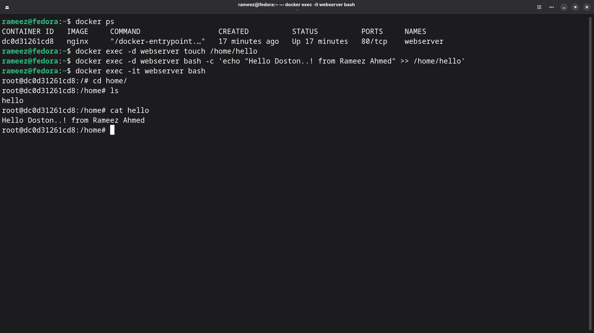
>
> **What to observe:**
> 1. `docker exec -d webserver touch /home/hello` → Creates a file inside the container without entering it
> 2. `docker exec -d webserver bash -c 'echo "Hello Doston..! from Rameez Ahmed" >> /home/hello'` → Writes to the file
> 3. `docker exec -it webserver bash` → Enter the container to verify
> 4. `cat hello` → Shows `Hello Doston..! from Rameez Ahmed` ✅

---

### 4.4 Inspecting a Running Container

```bash
# Get network details of a running container
docker inspect --format '{{json .NetworkSettings}}' webserver
```

**Command Breakdown:**

| Flag | What It Does |
|------|-------------|
| `docker inspect <container>` | Show ALL details about a container in JSON |
| `--format '{{json .Field}}'` | Extract specific fields using Go template syntax |
| `.NetworkSettings` | Network configuration section |
| `.NetworkSettings.IPAddress` | Just the IP address |
| `.State.Status` | Current state (running, paused, exited) |

> 📸 **Screenshot:** Inspecting the container's network settings:
>
> 
>
> **Key information from the inspect output:**

| Field | Value | What It Means |
|-------|-------|--------------|
| `SandboxID` | `221a7270e508...` | Unique network namespace ID |
| `SandboxKey` | `/var/run/docker/netns/221a7270e508` | Path to the network namespace file |
| `Ports` | `"80/tcp": null` | Port 80 is exposed but NOT mapped to a host port |
| `Networks.bridge` | (default) | Container is on the default `bridge` network |
| `Gateway` | `172.17.0.1` | The Docker bridge gateway IP |
| **`IPAddress`** | **`172.17.0.2`** | The container's own IP address |
| `MacAddress` | `fe:33:b6:b6:b5:81` | Virtual MAC address assigned to the container |
| `IPPrefixLen` | `16` | Subnet mask = /16 (172.17.0.0/16) |

> 💡 **Useful inspect shortcuts:**
> ```bash
> # Just get the IP address
> docker inspect --format '{{.NetworkSettings.IPAddress}}' webserver
> # → 172.17.0.2
>
> # Get the container's state
> docker inspect --format '{{.State.Status}}' webserver
> # → running
>
> # Get process ID of the container
> docker inspect --format '{{.State.Pid}}' webserver
> # → 12345
> ```

---

## Task 5: Cleanup

### 5.1 Stop All Running Containers

```bash
# See what's running
docker ps

# Stop ALL running containers in one command
docker stop $(docker ps -q)
```

**Command Breakdown:**

| Part | What It Does |
|------|-------------|
| `docker ps -q` | List only the container IDs of running containers (`-q` = quiet, IDs only) |
| `$(...)` | Command substitution — output becomes the argument |
| `docker stop $(docker ps -q)` | Stops every running container at once |

```bash
# Verify everything is stopped
docker ps       # → Empty (no running containers)
docker ps -a    # → Shows containers with "Exited" status
```

> 📸 **Screenshot:** Stopping all containers and cleaning up:
>
> 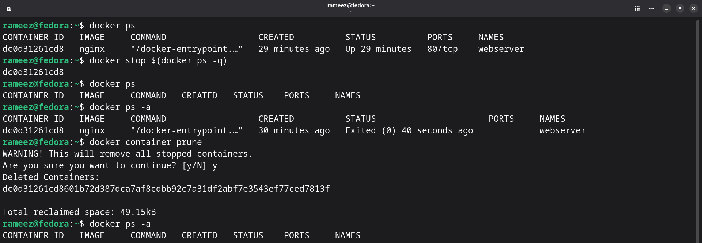
>
> **What to observe:**
> 1. `docker ps` → Shows `webserver` running
> 2. `docker stop $(docker ps -q)` → Stops it (returns container ID `dc0d31261cd8`)
> 3. `docker ps` → Empty now
> 4. `docker ps -a` → Shows `webserver` with **"Exited (0) 40 seconds ago"** — exit code 0 means clean stop

---

### 5.2 Remove All Stopped Containers

```bash
docker container prune
```

**Command Breakdown:**

| Command | What It Does |
|---------|-------------|
| `docker container prune` | Remove ALL stopped containers (asks for confirmation) |
| `docker container prune -f` | Force remove without confirmation prompt |

> **From the screenshot output:**
> - `WARNING! This will remove all stopped containers.`
> - `Are you sure you want to continue? [y/N] y`
> - `Deleted Containers: dc0d31261cd8601b72d387dca7af8cdbb92c7a31df2abf7e3543ef77ced7813f`
> - `Total reclaimed space: 49.15kB`
> - `docker ps -a` → Completely empty now! ✅

---

### 5.3 Remove All Images

```bash
# Remove all images at once
docker image rm $(docker images -q)
```

**Command Breakdown:**

| Part | What It Does |
|------|-------------|
| `docker images -q` | List only the image IDs (`-q` = quiet) |
| `docker image rm $(docker images -q)` | Remove every image on your machine |

> 📸 **Screenshot:** Removing all images:
>
> 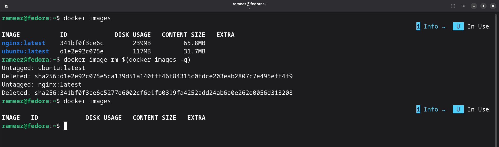
>
> **What to observe:**
> 1. `docker images` → Shows `nginx:latest` (239 MB) and `ubuntu:latest` (117 MB)
> 2. `docker image rm $(docker images -q)` → Untags and deletes both images with their SHA256 digests
> 3. `docker images` → Completely empty — all images removed from disk ✅

---

### 5.4 Check Docker Disk Usage

```bash
# See how much space Docker is using
docker system df

# Detailed breakdown
docker system df -v
```

**Command Breakdown:**

| Command | What It Does |
|---------|-------------|
| `docker system df` | Show disk usage summary (images, containers, volumes, build cache) |
| `docker system df -v` | Verbose — detailed breakdown per image/container/volume |
| `docker system prune` | Remove ALL unused data (stopped containers, dangling images, unused networks) |
| `docker system prune -a` | Remove EVERYTHING unused (⚠️ aggressive — includes unused images) |

---

## 🔧 Commands Reference with Flags

### Image Commands

| Command | Flags | What It Does |
|---------|-------|-------------|
| `docker pull <image>` | | Download an image from Docker Hub |
| `docker pull <image>:<tag>` | | Download a specific version (e.g., `nginx:1.25`) |
| `docker images` | | List all local images |
| `docker images` | `-a` | Include intermediate layers |
| `docker images` | `-q` | Show only image IDs |
| `docker image ls` | | Same as `docker images` |
| `docker inspect <image>` | | Show detailed JSON metadata |
| `docker inspect` | `--format '{{.Field}}'` | Extract specific field |
| `docker image history <image>` | | Show layers and their sizes |
| `docker image history` | `--no-trunc` | Show full commands |
| `docker image rm <image>` | | Remove an image |
| `docker rmi <image>` | | Same as `docker image rm` |
| `docker rmi` | `-f` | Force remove |
| `docker image prune` | | Remove dangling (untagged) images |
| `docker image prune` | `-a` | Remove ALL unused images |

### Container Lifecycle Commands

| Command | Flags | What It Does |
|---------|-------|-------------|
| `docker create` | `--name <name>` | Create container without starting |
| `docker start <name>` | | Start a stopped/created container |
| `docker stop <name>` | | Graceful stop (SIGTERM → 10s → SIGKILL) |
| `docker stop` | `--time 30` | Custom timeout before SIGKILL |
| `docker kill <name>` | | Immediate stop (SIGKILL) |
| `docker restart <name>` | | Stop + start |
| `docker pause <name>` | | Freeze all processes |
| `docker unpause <name>` | | Resume frozen processes |
| `docker rm <name>` | | Remove a stopped container |
| `docker rm` | `-f` | Force remove (stop + delete) |
| `docker rename <old> <new>` | | Change container name |

### Container Inspection Commands

| Command | Flags | What It Does |
|---------|-------|-------------|
| `docker ps` | | List running containers |
| `docker ps` | `-a` | List ALL containers (including stopped) |
| `docker ps` | `-q` | Show only container IDs |
| `docker ps` | `-l` | Show only the last created container |
| `docker logs <name>` | | View container output |
| `docker logs` | `-f` | Follow logs in real-time |
| `docker logs` | `--tail N` | Show last N lines |
| `docker logs` | `-t` | Add timestamps |
| `docker logs` | `--since 1h` | Logs from last N time |
| `docker exec <name> <cmd>` | | Run a command in a running container |
| `docker exec` | `-it` | Interactive terminal |
| `docker exec` | `-d` | Run in background |
| `docker inspect <name>` | | Full JSON details |
| `docker inspect` | `--format` | Extract specific fields |
| `docker stats` | | Live CPU/memory/network usage |
| `docker top <name>` | | Show processes running in container |

### Cleanup Commands

| Command | Flags | What It Does |
|---------|-------|-------------|
| `docker container prune` | | Remove ALL stopped containers |
| `docker container prune` | `-f` | Skip confirmation prompt |
| `docker image prune` | | Remove dangling images |
| `docker image prune` | `-a` | Remove ALL unused images |
| `docker system df` | | Show Docker disk usage |
| `docker system df` | `-v` | Verbose breakdown |
| `docker system prune` | | Remove all unused data |
| `docker system prune` | `-a` | Remove EVERYTHING unused |
| `docker system prune` | `-f` | Skip confirmation |

---

## 🧠 Summary

```
┌──────────────────────────────────────────────────────────────────┐
│                    KEY CONCEPTS — DAY 30                          │
├──────────────────────────────────────────────────────────────────┤
│                                                                  │
│  DOCKER IMAGES                                                   │
│  • Images = read-only blueprints for containers                  │
│  • Alpine (14MB) vs Ubuntu (117MB) vs Nginx (239MB)             │
│  • Use `docker inspect` to see config, ports, env vars          │
│                                                                  │
│  IMAGE LAYERS                                                    │
│  • Every image = stack of layers                                 │
│  • Only RUN/COPY/ADD commands create layers with size            │
│  • Layers are shared between images = saves disk space           │
│  • Layers are cached = faster builds                             │
│                                                                  │
│  CONTAINER LIFECYCLE                                             │
│  • Created → Running → Paused → Running → Stopped → Removed    │
│  • docker stop = graceful (SIGTERM). docker kill = forced        │
│  • Exit code 0 = clean. Exit code 137 = killed by signal        │
│                                                                  │
│  WORKING WITH CONTAINERS                                         │
│  • docker exec -it = interactive shell (debugging)               │
│  • docker exec -d = run command in background                   │
│  • docker logs -f = follow real-time output                      │
│  • docker inspect = deep dive into container config             │
│                                                                  │
│  CLEANUP                                                         │
│  • docker stop $(docker ps -q) = stop ALL at once               │
│  • docker container prune = remove all stopped                   │
│  • docker system prune -a = nuclear option (remove everything)  │
│                                                                  │
└──────────────────────────────────────────────────────────────────┘
```

---

<div align="center">

**Day 30 Complete ✅ — Docker Images & Container Lifecycle Mastered!** 🐳

*"Understanding layers is the difference between 50MB images and 2GB images."*

**#90DaysOfDevOps #TrainWithShubham**

</div>
